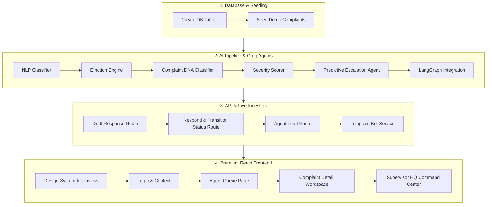

# Implementation Plan — UCCD POC (Judge-Perspective Roadmap)

To win the iDEA 2.0 challenge (Phase 2), a judge expects to see a working system that proves **HOW** the solution works, goes beyond basic API wrappers, demonstrates deep banking customization, and offers a premium visual experience.

This plan breaks down the development of the **Unified Customer Complaint Communication Dashboard (UCCD)** into fine-grained, step-by-step sub-parts.

---

## 👨‍⚖️ The Judge's Rubric: What We Must Prove
1. **End-to-End Flow:** A real complaint must ingest from an external channel (Telegram), pass through a multi-agent AI pipeline, persist in a Postgres DB, and trigger real-time updates on a supervisor's screen via WebSockets.
2. **Innovative AI Agents (Not a generic wrapper):**
   - **Emotion Arc:** Showing the emotional progression of a customer across messages (e.g., *Angry* ➔ *Frustrated*).
   - **Complaint DNA:** Grouping complaints semantically into "clusters" (e.g., auto-detecting that 5 reports are about the same ATM network outage).
   - **Predictive Escalation:** Predicting SLA breaches *before* they occur using current queue size and severity.
3. **Interactive Visual Dashboard:** A high-fidelity frontend with live SLA timers, agent load metrics, and a real-time event ticker.

---

## 🛠️ Step-by-Step Sub-Parts Breakdown

---

### Step 1: Database Setup & Seeding

#### 1.1 Tables Initialization
- Verify table creation schema in Neon Postgres database using [create_tables.py](file:///d:/UCCD/scripts/create_tables.py).
- Ensure all AI-generated fields (`emotion_arc`, `severity_score`, `cluster_id`, `breach_probability`, `pre_escalate`, `ai_draft`) exist in the database model.

#### 1.2 [NEW] Database Seeding Script (`scripts/seed_demo.py`)
- Programmatically insert 15-20 complaints.
- **Custom Banking Data:** Create realistic complaints tailored for Union Bank (e.g., ATM card stuck at a Union Bank kiosk, UPI payment timeout, home loan delay, phishing report).
- Run complaints through the LangGraph AI pipeline during seeding to populate realistic tags.

---

### Step 2: AI Pipeline & Groq Agents (`agents/`)

Implement the multi-agent AI pipeline in `agents/orchestrator.py` using Groq's Llama-3.1 model.

#### 2.1 NLP Classifier Enhancement
- Ensure the classifier extracts: `complaint_type`, `product_code`, `intent`, and `regulatory_obligation`.
- Inject a confidence score metric to show model certainty.

#### 2.2 Emotion Engine Agent (`run_emotion`)
- Send the text to Groq Llama to extract:
  - `initial_sentiment` (e.g. Angry, Frustrated, Neutral)
  - `intensity_score` (1-10)
  - `arc_trajectory` (Negative, Neutral, Positive)
- Return JSON structure: `{"initial": "Angry", "current": "Frustrated", "trajectory": "Negative"}`.

#### 2.3 Complaint DNA Clustering Agent (`run_dna`)
- Extract key semantic entities (e.g. "ATM", "Double debit", "UPI failure") using Llama.
- Query the database to see if other open complaints share similar entities. If yes, link to that `cluster_id`. If not, generate a new `cluster_id` (e.g., `CLUSTER_UPI_TIMEOUT`).

#### 2.4 Severity Scorer Agent (`run_severity`)
- Grade severity from `0.0` (Low) to `1.0` (Critical).
- Weighing factors: VIP status (0.2), regulatory channel/ombudsman trigger words (0.4), and customer sentiment (0.2).

#### 2.5 Predictive Escalation Agent (`run_escalation`)
- Estimate breach probability (0.0 to 1.0) using:
  - Severity score
  - SLA tier duration
  - Current queue size (query count of complaints with status `queued` / `in_progress`).
- If probability > 0.70, set `pre_escalate = True` and write the reason.

#### 2.6 LangGraph Merging & DB Saving
- Compile all agent nodes into the LangGraph pipeline (`orchestrator.py`).
- Merge results in `merge_and_save` and write back to the Postgres DB.
- Trigger Redis SLA timers on successful pipeline completion.

---

### Step 3: API Endpoints & Telegram Bot Ingestion

#### 3.1 Draft Generation Route (`GET /api/v1/ai/draft/{complaint_id}`)
- Call Groq Llama to draft a personalized response.
- **Tone-matching:** An angry customer gets an empathetic, apologetic tone; a regulatory query gets a formal, structured tone.
- Contextualize with customer profile data (e.g. name, account type, specific transaction details).

#### 3.2 Respond & Resolve Route (`POST /api/v1/complaints/{complaint_id}/respond`)
- Record final response in the database.
- Transition status from `in_progress` to `resolved`.
- Record resolution timestamps and notes.
- Broadcast status change via WebSockets.

#### 3.3 Agent Load Route (`GET /api/v1/agents/load`)
- Query database for active loads per role/department (e.g. Loan dept: 3 active, Card fraud: 5 active).

#### 3.4 [NEW] Telegram Bot Ingestion (`services/telegram_bot.py`)
- Set up a background polling thread using Python's standard libraries or `python-telegram-bot`.
- **Inbound Message Flow:**
  - Receive message from customer ➔ Call `POST /api/v1/complaints` ➔ Run AI pipeline.
  - Return the registered ticket ID and AI response directly back to the customer's Telegram chat.

---

### Step 4: Premium React Frontend (`frontend/`)

Initialize a modern Vite + React + TypeScript web app styled with deep space navy, teal accents, and glassmorphic designs.

#### 4.1 Login Screen
- Credentials page supporting JWT login.
- Role toggle selector:
  - `AGENT` ➔ Directs to Agent Queue Workspace.
  - `SUPERVISOR` ➔ Directs to Supervisor HQ Dashboard.

#### 4.2 Agent Queue ("My Queue")
- List of open complaints assigned to the logged-in agent.
- Display cards with: customer name, channel icon (Telegram, Email, App), category tags, priority badge, and a live SLA countdown bar (which changes color from green to orange/red as deadline approaches).

#### 4.3 Complaint Detail Page (3-Column Workspace)
- **Col 1 (Customer Context):** Customer metadata, timeline of previous complaints, transaction ledger context.
- **Col 2 (Communication & AI Draft):** Chat thread showing customer's text. Underneath, a glowing card containing the **AI-generated response draft** with an "Edit Draft" text box and "Send Response" button.
- **Col 3 (AI Triage Panel):** Visualizes the classifier categories, severity dial, emotion arc graph, related cluster indicator, and Next Best Actions.

#### 4.4 Supervisor HQ Command Center
- **KPI Metrics Ribbon:** Total complaints, pending queues, active escalations, breached tickets.
- **Escalation Queue:** Special panel showing tickets flagged by the Predictive Escalation agent (probability > 70%) with reasons.
- **Agent Capacity Meters:** Interactive bars displaying current workloads.
- **Real-Time AI Feed:** Scrolling feed powered by WebSockets, showing a live ticker of complaints being processed (e.g., *"Complaint #1234 received via Telegram: Classified as Card Fraud (Severity: 0.85)"*).

---

## 🔍 Verification Plan

1. **Local Dev Setup:** Run backend on port 8000, start Redis on port 6379, and start Vite dev server on port 5173.
2. **Database & Seeding Verification:** Execute `seed_demo.py` and inspect database rows to verify populated AI fields.
3. **Telegram Bot Real-time Ingestion:** Send a complaint to the live Telegram bot, verify that the bot replies with the correct ticket details, and check if it instantly renders on the dashboard.
4. **End-to-End User Journeys:**
   - Log in as Agent ➔ View the complaint ➔ Edit and send the AI draft ➔ Check ticket resolution status.
   - Log in as Supervisor ➔ Watch live WebSocket feeds and capacity bars update as complaints are created and resolved.
